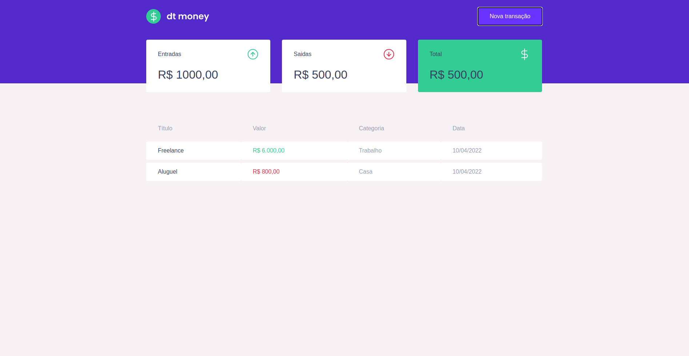

# Dt Money

This project was created during the rockeseat Ignite course, but after completing this module i modified the code according to the standards and good practices that the lib preaches.

## TO DO

- ✔️ Create Modal Provider.
- ✔️ Create transactions list.
- ✔️ Create new transaction.
- ❌ Create Transaction update.
- ❌ Create Transaction delete.
- ❌ Create CRUD categories.
  - ❌ Create categories list.
  - ❌ Create new category.
  - ❌ Update category.
  - ❌ Delete category.
- ❌ Create Toastr component for feedback actions.
- ❌ Create mobile version.
- ❌ Unit tests.
- ❌ Github pipes.

## Architecture

├── README.md
├── db.json
├── package.json
├── public
| ├── favicon.ico
| └── index.html
├── screenshots
| ├── preview01.png
| ├── preview02.png
| └── preview03.png
├── src
| ├── App.tsx
| ├── assets
| ├── config
| ├── index.tsx
| ├── pages
| ├── react-app-env.d.ts
| ├── routes
| ├── shared
| └── styles
├── tsconfig.json
├── yarn-error.log
└── yarn.lock

## Preview

coming soon

### Desktop

### Mobile

coming soon
